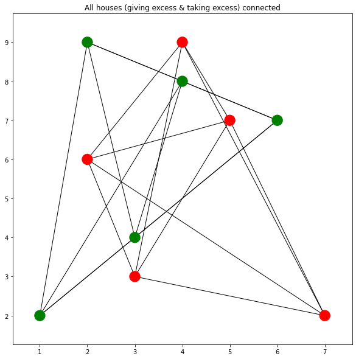
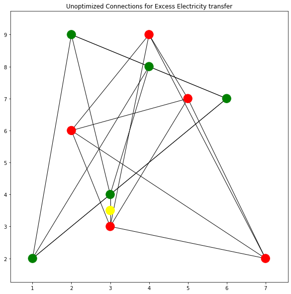
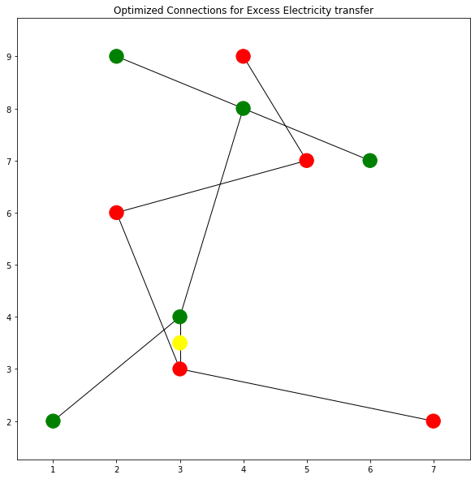

# SolarElectricity-Distribution
This following project uses The Minimum Spanning Tree over the connected components
(Here the two connected components are the Giving houses and the taking houses)
This aims to help direct the flow of the excess electricity to a grid and then redistribute
it to houses which need electricity

This is a very useful approach in todays day and scenario
as this approach can efficiently help us to direct the electricity and 
also check the electric consumption by each person who needs it and track
who gives the electricity so someone can not overuse the solar electricity generated by someone else 
by directly connecting it to them

The Minimum Spanning Tree algorithm has been used for finding the most minimized costs
We will focus on our application here
(Note: The weights here are the distance between each vertex as a 2D plane)
lets assume green is the houses giving the electricity (excess) and red is the ones taking it (needy)
and we also assume that the two categories of houses are going to be connected componenents

Now we place a grid by finding the least distance between the vertexes and place it in between

Now we use a Minimum Spanning Tree Algorithm to find the Minimum Spanning Tree for both connected components
(Kruskals or Prims)

